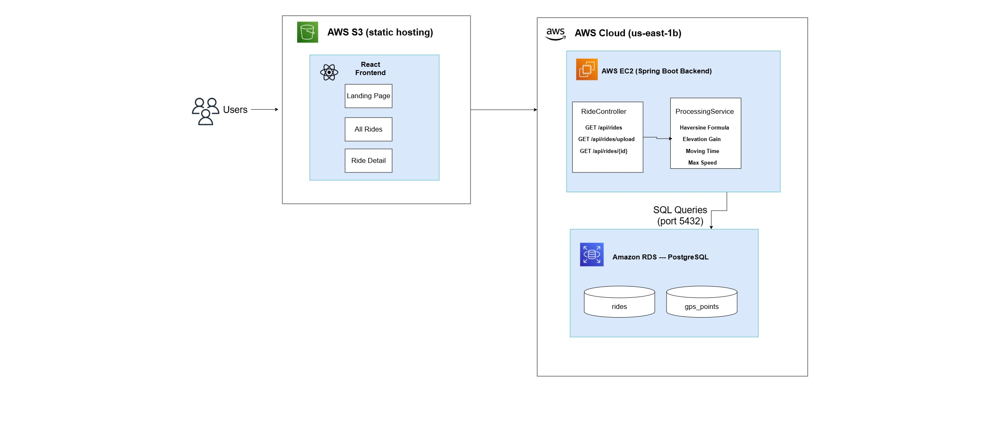

# VeloRoute - Full-Stack Cycling Analytics Engine

Welcome to the VeloRoute repo! This is a geospatial dashboard that accepts a GPS coordinate file and calculates biking metrics in real-time and visualizes your biking journey!


This project is a full-stack web application for uploading, analyzing, and visualizing cycling GPS routes. Users upload a converted GPX ride file (converted to JSON) and the applicaiton calculates key metrics such as total distance travelled, and animates your route on an interactive map. The appplication is hosted on AWS. You can check it out at the link below:

**Live Demo:** http://veloroute-frontend.s3-website-us-east-1.amazonaws.com

---
## Architecture Diagram


---

## Tech Stack

**Frontend**
- React + Vite
- React Router Dom
- Leaflet.js + React Leaflet (interactive maps used for route visualization)

**Backend**
- Java 21 + Spring Boot 3
- Spring Data JPA + Hibernate
- PostgreSQL
- Async processing using `@Async` and `@EnableAsync`

**Cloud Infrastructure (AWS)**
- AWS EC2 (Spring Boot Backend hosting)
- AWS RDS (PostgreSQL DB)
- AWS S3 (React Frontend hosting)
---

## Features

- Upload converted GPX file (to JSON)
- Automatically calculates the following metrics:
  - Total Distance traveled (km)
  - Total Elevation Gain (m)
  - Average Speed (km / h)
  - Max Speed (km / h)
  - Moving Time
- Interactive route map that visualizes trip with an animated bike icon
- Real-time metric updates during route animation
- Asynchronous file processing with polling (allowing UI to stay responsive during file upload without memory errors)

---

## How to Use the Application

1. **Convert** your `.gpx` file to `.json` using the `convert.js` script included in this repository
   1. To run the script, execute the following command: `node convert.js your-ride.gpx`
2. **Upload** the `.json` file by clicking the `Upload` button
3. The Backend will immediately return a `202 Accepted` response with the ride ID
4. File Processing runs asynchronously. The Haversine formula calculates distances between each GPS point, elevation gain is accumulated and moving time is computed
5. The frontend polls every 2 seconds until processing is complete
6. The uploaded rise appears on the **All Rides** page, which displays a preview of the metrics and a clickable icon to view the ride in detail and the interactive route map to visualize your trip

---

## How to Run Locally

### You need to have the following installed
- Java 21
- Maven
- Docker
- Node.js

### 1. Clone Repository
``` bash
git clone https://github.com/mohammadikhan/analyzer.git
cd analyzer
```

### 2. Set up Environment Variables
``` bash
cp .env.example .env
```
Fill in `.env` with your DB credentials
```
POSTGRES_DB=veloroute
POSTGRES_USER=postgres
POSTGRES_PASSWORD=your-password
```

### 3. Start the DB
``` bash
docker-compose up -d
```

### 4. Start the Backend
``` bash
mvn spring-boot:run
```

### 5. Start the Frontend
``` bash
cd frontend
npm install
npm run dev
```

The application will be up and running at `http://localhost:5173`

--- 


